<div align="center">


# VerseKit

**Dein Werkzeugkasten für Star Citizen — Baupläne, Aufträge, Herstellung, Handel und mehr, live beim Spielen**

<sub>ehemals **SC BP Watcher** · dein Bestand und deine Einstellungen bleiben erhalten</sub>

<sub>Windows · Linux · ohne Konto, ohne Cloud — Installer unter Windows, einzelne Datei unter Linux</sub>

[](https://github.com/Xharig/VerseKit/releases)
[](https://github.com/Xharig/VerseKit/releases)
[](https://xharig.github.io/VerseKit/)
[](LICENSE)
[](https://discord.gg/g2E7e6XxZC)
[](https://ko-fi.com/xharig)
[](https://www.python.org/)
[](#voraussetzungen)
[](https://robertsspaceindustries.com/enlist?referral=STAR-YC7L-S4W2)

**Deutsch** · [English](https://github.com/Xharig/VerseKit/blob/main/README.en.md)

</div>

---

Ein kleines, randloses Overlay, das beim Spielen **in Echtzeit** meldet, sobald ein neuer Bauplan (Blueprint) dazukommt — inklusive Name, Art und Uhrzeit. Ohne Account, ohne Cloud. Läuft unter **Windows und Linux**.

> 🌐 **Es gibt eine Webseite.** Auf **[xharig.github.io/VerseKit](https://xharig.github.io/VerseKit/)** klickst du dich durch alle Bereiche und siehst, wie das Werkzeug aussieht — bevor du etwas herunterlädst. Deutsch und Englisch.

> 💬 **Es gibt einen Discord.** Fragen, Hilfe bei Problemen, neue Versionen und ein Forum für Fehler und Wünsche: **[discord.gg/g2E7e6XxZC](https://discord.gg/g2E7e6XxZC)**. Wer lieber hier bleibt, macht ein [Issue](https://github.com/Xharig/VerseKit/issues) auf — beides wird gelesen.

> 🧪 **Testversionen ausprobieren.** Vor jeder Veröffentlichung gibt es **Vorabversionen** (`-rc`) unter [Releases](https://github.com/Xharig/VerseKit/releases) — dort steht bei jeder, was sie bringt und was sich seit der vorigen geändert hat. Als Update angeboten werden sie **nur, wenn du** unter **Info → Update & Über → „Auch Testversionen"** einschaltest — alle anderen bekommen nur fertige Versionen. Wer eine ausprobiert und etwas findet, macht bitte ein [Issue](https://github.com/Xharig/VerseKit/issues) auf — genau dafür sind sie da.

<table>
<tr>
<td width="32%" valign="top" align="center">
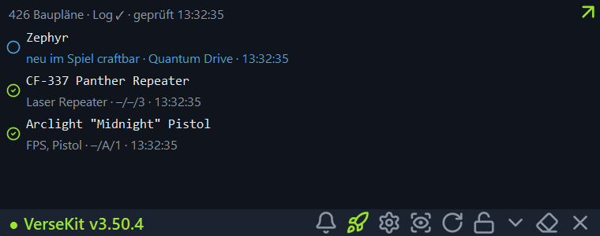<br>
<sub>Das Overlay — schmal, immer im Vordergrund, Durchsichtigkeit einstellbar</sub>
</td>
<td width="68%" valign="top" align="center">
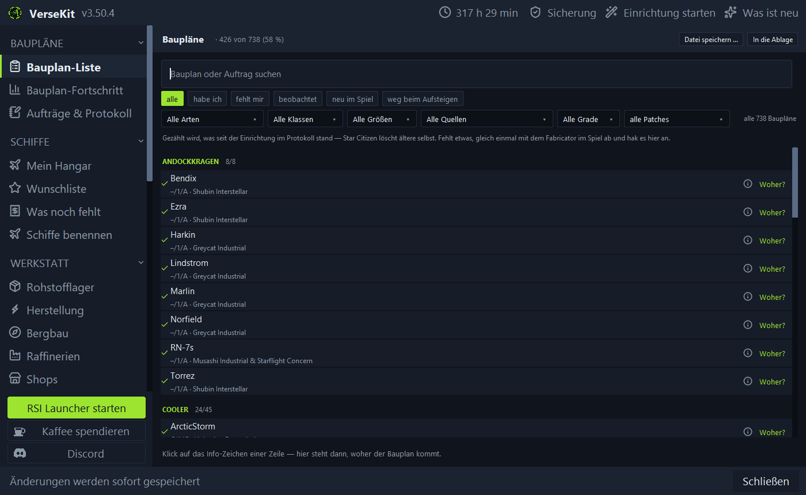<br>
<sub>Die Bauplan-Liste — Suche, fünf Filter und die Herkunft je Bauplan</sub>
</td>
</tr>
</table>

### Im Spiel, ohne herauszutabben

Der Watcher schreibt in die Auftragstexte des Spiels, **welche** Baupläne ein Auftrag ausschüttet — mit `[x]` für das, was du schon hast. Die Zählung steht schon im Titel, die Namen in der Beschreibung.

<table>
<tr>
<td width="50%" valign="top" align="center">
<br>
<sub><b>3 von 6</b> — <code>[x]</code> hast du, <code>[&nbsp;&nbsp;]</code> fehlt noch</sub>
</td>
<td width="50%" valign="top" align="center">
<br>
<sub><b>0 von 12</b> — hier ist noch nichts dabei, was du hast</sub>
</td>
</tr>
</table>

### Meine Schiffe

Ein neuer Bauplan wirft sofort die nächste Frage auf: **passt das Teil überhaupt in eines meiner Schiffe?** Dafür muss das Werkzeug wissen, was in deinem Hangar steht — das Spiel schreibt es nirgends auf.

<table>
<tr>
<td colspan="2" valign="top" align="center">
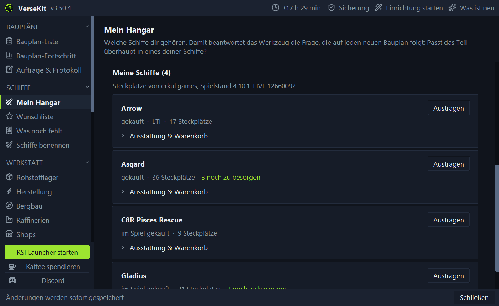<br>
<sub><b>Mein Hangar</b> — in einem Zug aus dem Pledge-Store geholt oder von Hand eingetragen; danach steht in der Herstellung, in welche deiner Schiffe ein Bauplan passt</sub>
</td>
</tr>
<tr>
<td colspan="2" valign="top" align="center">
<br>
<sub><b>Schiffe benennen</b> — so sieht es <b>im Spiel</b> aus: eigene Namen im Abrufterminal statt der Werksnamen. Das Sternchen markiert nicht nur — weil der Flottenmanager alphabetisch sortiert, rutschen die markierten Schiffe nach oben</sub>
</td>
</tr>
<tr>
<td width="50%" valign="top" align="center">
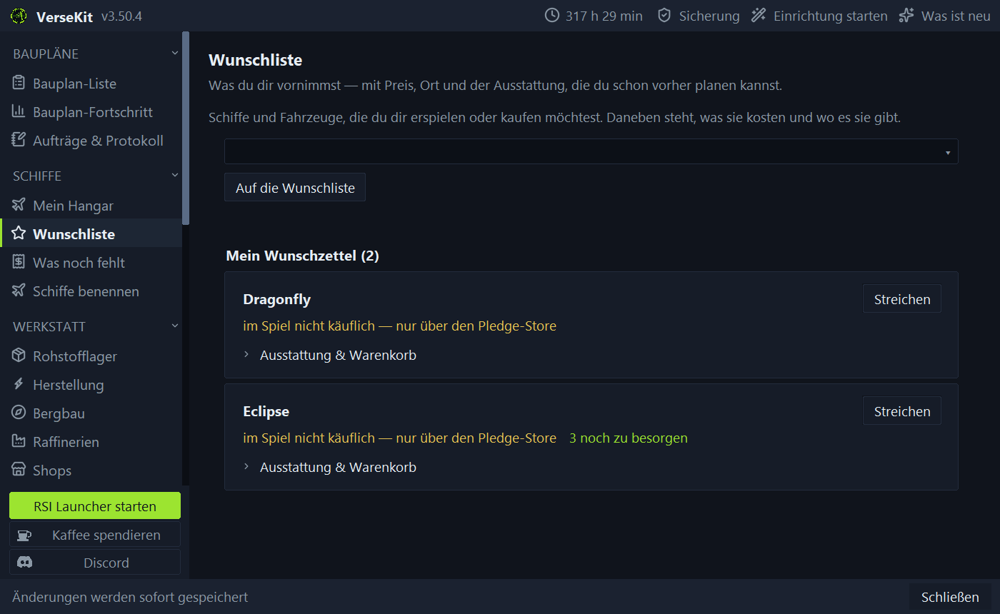<br>
<sub><b>Wunschliste</b> — was du dir vornimmst, mit Kaufpreis und Ort; die Ausstattung lässt sich planen, bevor du das Schiff besitzt</sub>
</td>
<td width="50%" valign="top" align="center">
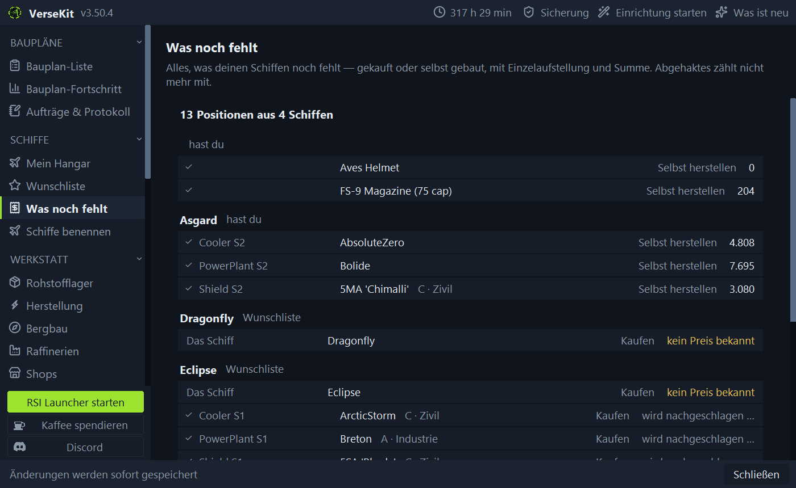<br>
<sub><b>Was noch fehlt</b> — die Rechnung über alle Schiffe: kaufen oder selbst bauen je Posten, mit Summe und Einkaufsroute</sub>
</td>
</tr>
<tr>
<td width="50%" valign="top" align="center">
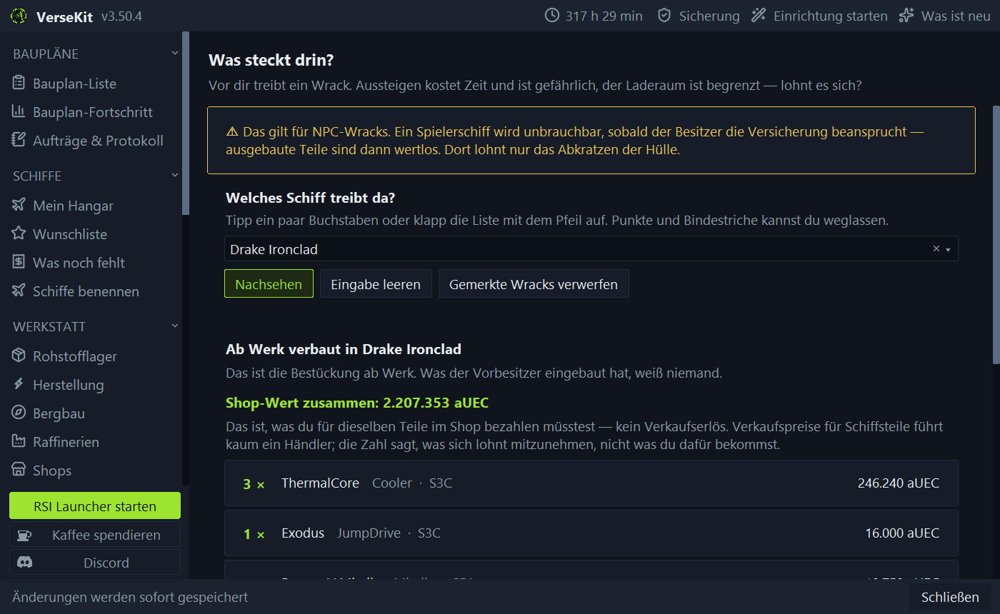<br>
<sub><b>Was steckt drin?</b> — was ein Wrack ab Werk an Bord hat und was die Teile im Laden wert sind</sub>
</td>
<td width="50%" valign="top" align="center">
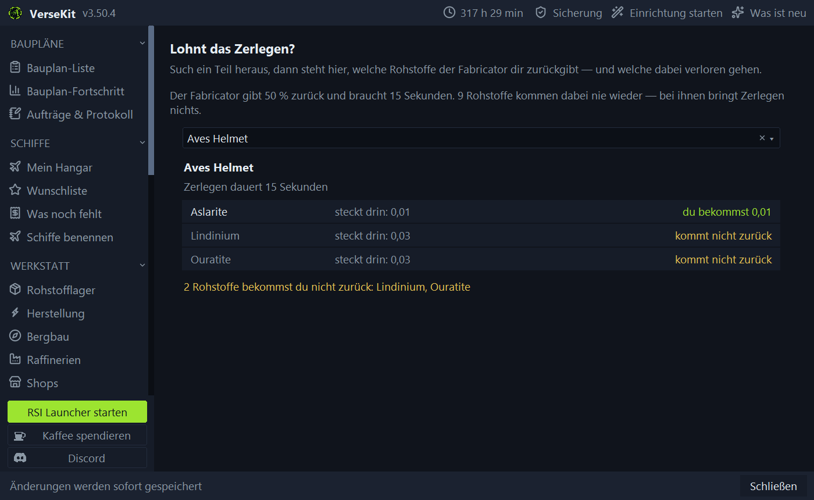<br>
<sub><b>Lohnt das Zerlegen?</b> — was der Fabricator zurückgibt, und welche Rohstoffe dabei ersatzlos verschwinden</sub>
</td>
</tr>
</table>

### Die Werkstatt

Der Bauplan ist der Anfang. Die Werkstatt beantwortet, was danach kommt: **was brauche ich, habe ich das, und was wird daraus?**

<table>
<tr>
<td width="50%" valign="top" align="center">
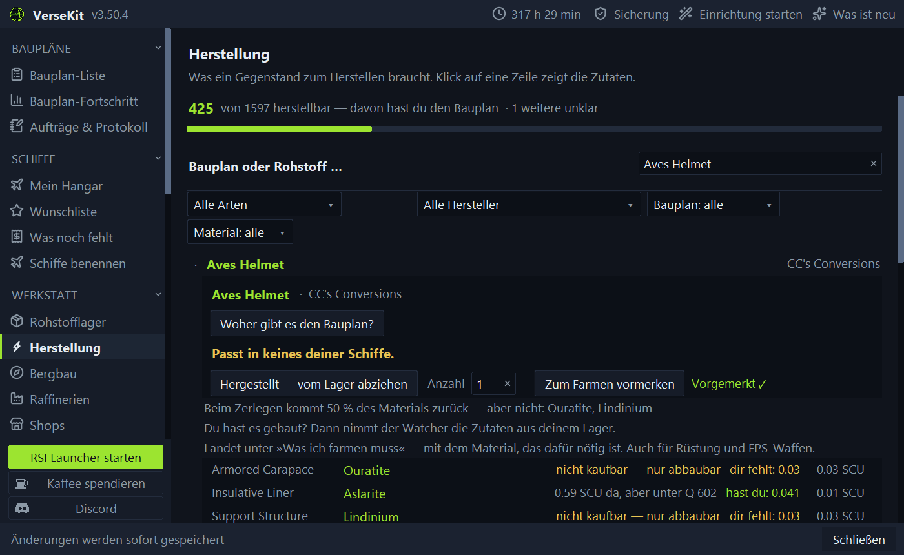<br>
<sub><b>Herstellung</b> — Zutaten, Herstellzeit und was <i>dein</i> Material aus den Werten macht</sub>
</td>
<td width="50%" valign="top" align="center">
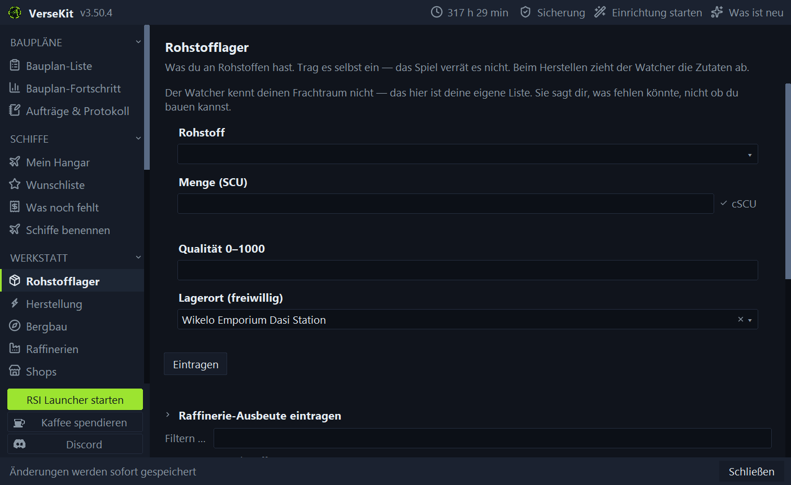<br>
<sub><b>Rohstofflager</b> — Material, Menge, Qualität und Lagerort, von Hand gepflegt</sub>
</td>
</tr>
<tr>
<td colspan="2" valign="top" align="center">
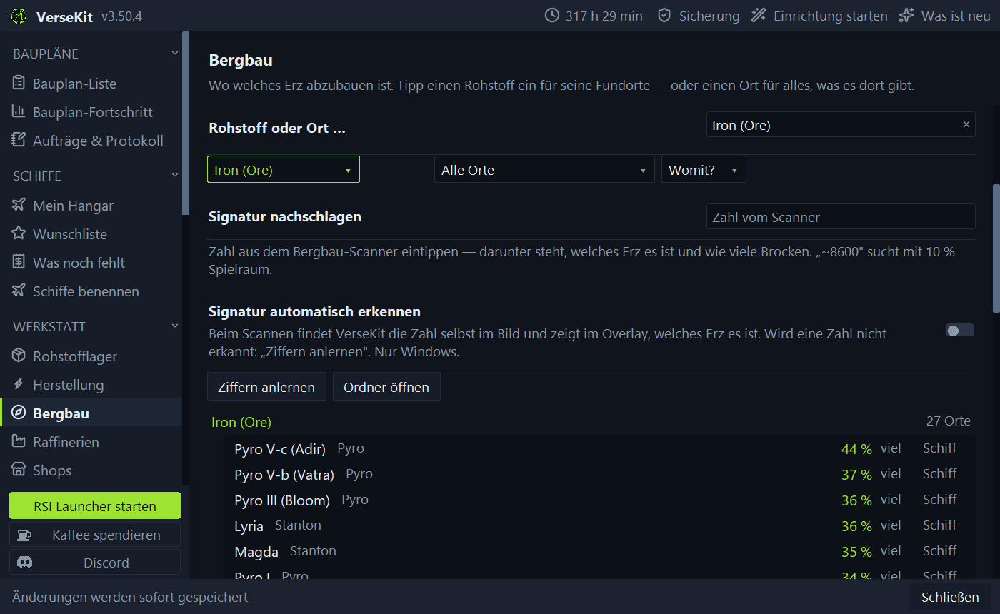<br>
<sub><b>Bergbau</b> — Rohstoff eintippen und sehen, wo er liegt; oder den Scan-Wert eingeben und sehen, was der Scanner da gefunden hat</sub>
</td>
</tr>
</table>

### Handel

Der Laderaum ist voll — und jetzt? **Wo werde ich die Ladung los, und was bringt sie je SCU?**

<table>
<tr>
<td width="50%" valign="top" align="center">
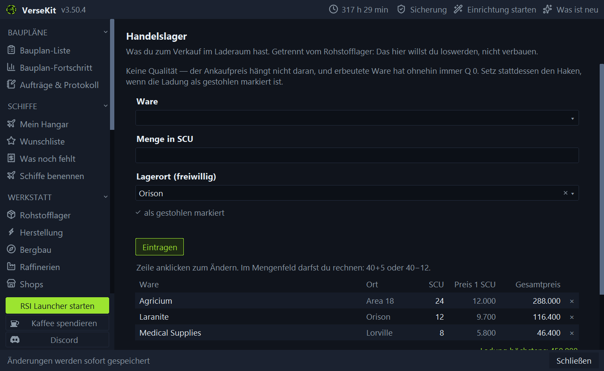<br>
<sub><b>Handelslager</b> — was zum Verkauf im Laderaum liegt, getrennt vom Rohstofflager</sub>
</td>
<td width="50%" valign="top" align="center">
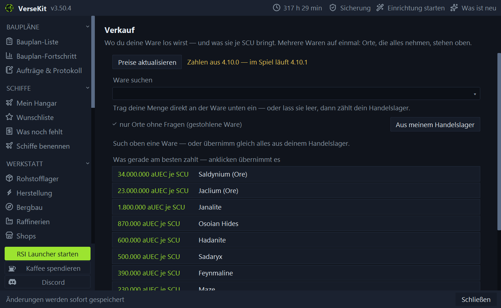<br>
<sub><b>Verkauf</b> — die besten Ankäufer, sortiert danach, wie viele deiner Waren ein Ort abnimmt</sub>
</td>
</tr>
</table>

### Das Fenster

> [!NOTE]
> Die Bilder werden vor jeder Veröffentlichung neu erzeugt und zeigen diese Version. Wer eine ältere benutzt, findet manches hier Gezeigte noch nicht.

<table>
<tr>
<td width="50%" valign="top" align="center">
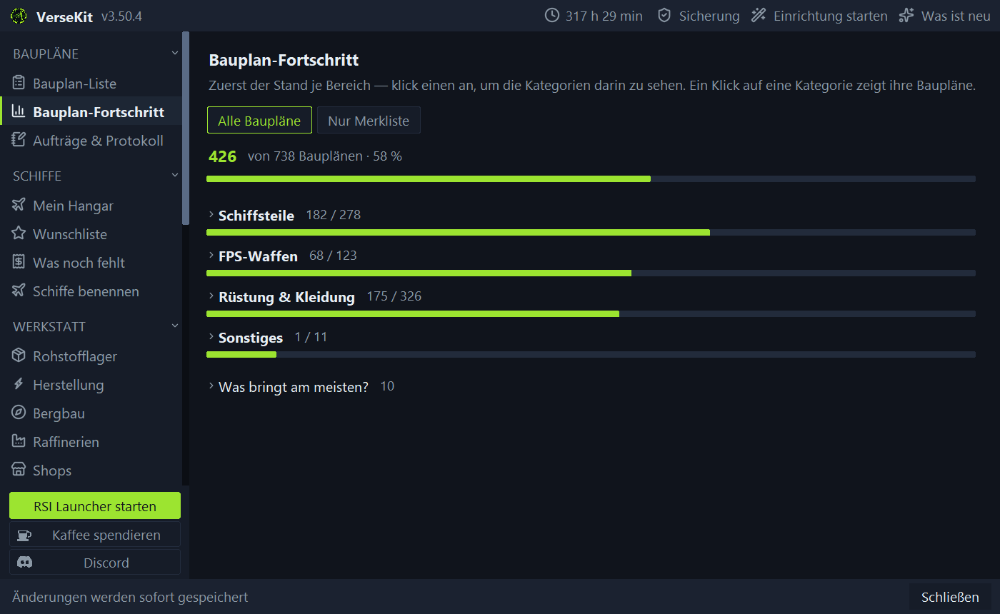<br>
<sub><b>Fortschritt</b> — je Bereich, Einzelheiten auf Klick</sub>
</td>
<td width="50%" valign="top" align="center">
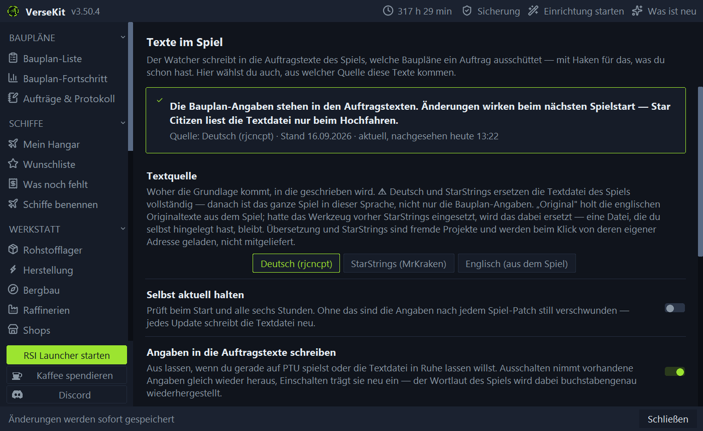<br>
<sub><b>Texte im Spiel</b> — Textquelle wählen, ein- und ausschalten</sub>
</td>
</tr>
<tr>
<td valign="top" align="center">
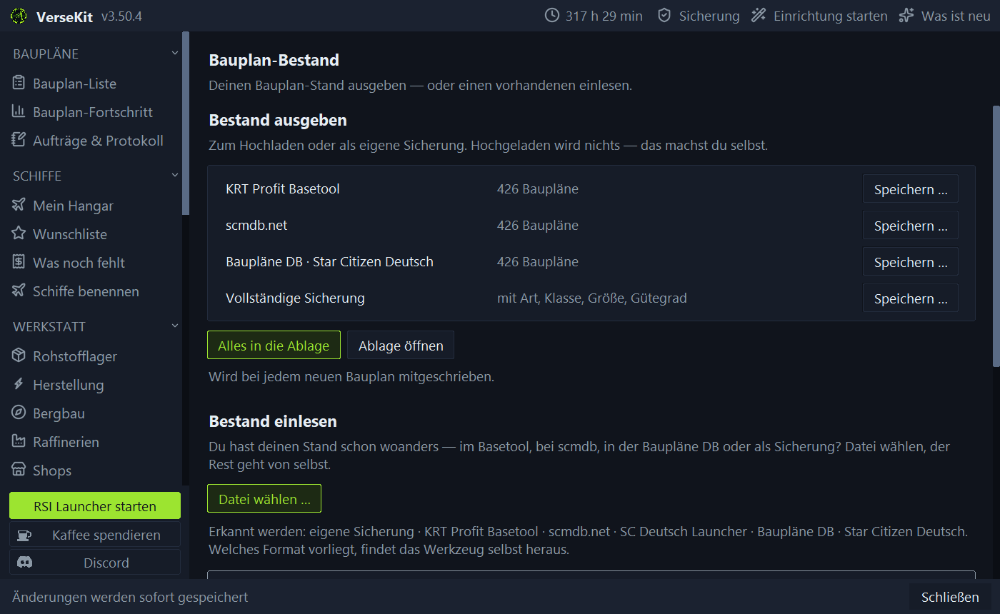<br>
<sub><b>Bestand</b> — ausgeben fürs Basetool, oder einen vorhandenen einlesen</sub>
</td>
<td valign="top" align="center">
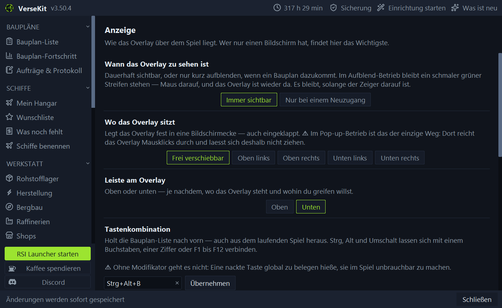<br>
<sub><b>Anzeige</b> — Aufblend-Betrieb, Klicks durchreichen, Schriftgröße</sub>
</td>
</tr>
<tr>
<td valign="top" align="center">
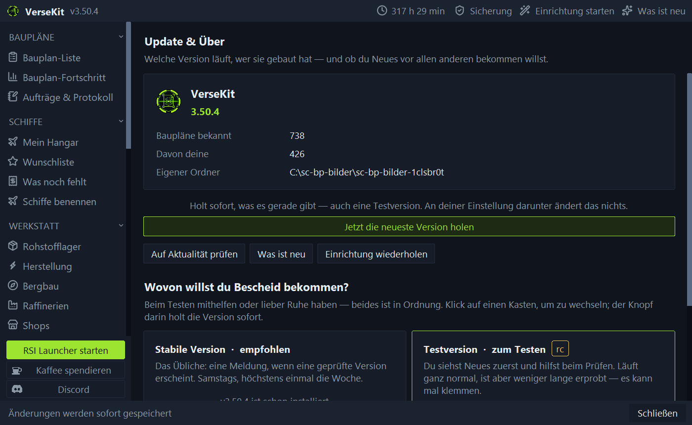<br>
<sub><b>Über</b> — stabile Version oder Testversionen, mit Knopf zum Holen</sub>
</td>
<td valign="top" align="center">
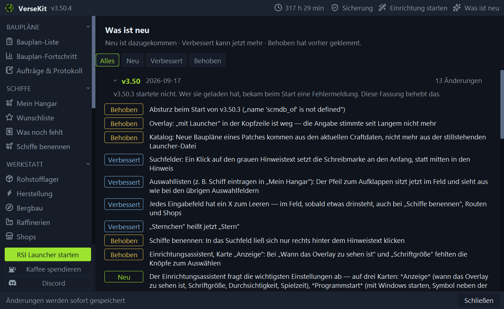<br>
<sub><b>Was ist neu</b> — jede Version aufklappbar, gefiltert nach Art</sub>
</td>
</tr>
<tr>
<td valign="top" align="center">
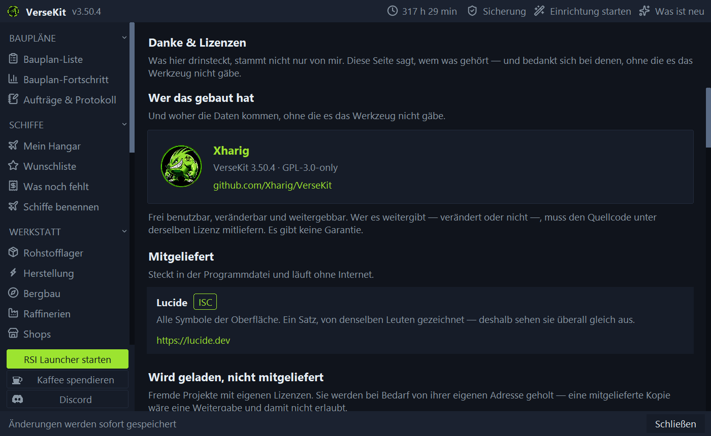<br>
<sub><b>Danke &amp; Lizenzen</b> — wem was gehört, und wer mitgeholfen hat</sub>
</td>
<td valign="top" align="center">
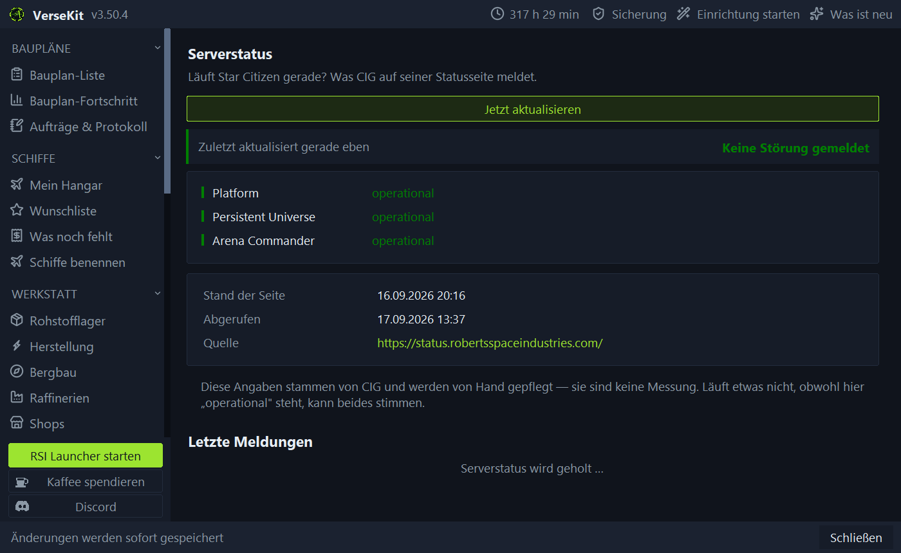<br>
<sub><b>Serverstatus</b> — läuft Star Citizen gerade?</sub>
</td>
</tr>
</table>

<details>
<summary>Und der Rest: Allgemein</summary>

<table>
<tr>
<td width="50%" valign="top" align="center">
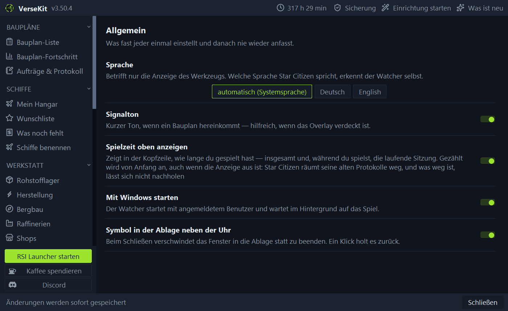<br>
<sub><b>Allgemein</b> — Sprache, Signalton, Autostart, Startmenü-Eintrag</sub>
</td>
<td width="50%" valign="top" align="center">
</td>
</tr>
</table>

</details>

### Was Totzone, Sättigung und Empfindlichkeit bewirken

Unter **Für Fortgeschrittene → Achsen & Kurven** lässt sich einstellen, wie scharf jede Stick-Achse reagiert. Drei Werte, und jeder verbiegt die Kurve anders:


| Wert | Was er macht | Wofür |
|---|---|---|
| **Totzone** | Der Anfang des Wegs tut nichts | Gegen zitternde Sticks, die in der Mitte nicht ruhig stehen |
| **Sättigung** | Vollausschlag schon vor dem Anschlag | Wenn der Stick mechanisch nicht ganz durchgeht oder volle Wirkung früher kommen soll |
| **Empfindlichkeit** | Über 1 hängt die Kurve durch, unter 1 wölbt sie sich | Über 1: feineres Zielen um die Mitte. Unter 1: direkter, giftiger |

Die gestrichelte Linie zeigt, wie es ohne jede Einstellung liefe. Die dunklen Flächen sind der Weg, auf dem sich nichts mehr ändert.

> [!NOTE]
> Star Citizen merkt sich diese Werte an einer internen Nummer des Geräts, nicht an seinem Namen. Bekommt ein Stick eine neue Nummer — anderer USB-Anschluss, neue Firmware —, hält das Spiel ihn für ein neues Gerät, und die alten Werte bleiben wirkungslos in der Datei stehen. Der Watcher findet solche Altlasten und räumt sie auf Wunsch weg.

## Warum dieses Tool

Bauplan-Listen gibt es mehrere. Vier Dinge machen den Unterschied im Alltag:

- **Du musst nicht aus dem Spiel.** Das Overlay liegt über Star Citizen. Kein zweites Fenster, kein Alt-Tab, kein Nachschlagen im Browser — der neue Bauplan steht einfach da, während du weiterspielst.
- **Es weiß, was du schon hast.** Der Watcher führt deinen Bauplan-Bestand selbst und liest beim ersten Start die aufgehobenen Spielprotokolle nach — du bekommst deinen bisherigen Stand geschenkt, ohne etwas einzutippen. Bleibt trotzdem eine Lücke, sagt er das, statt eine unvollständige Liste als vollständig auszugeben.
- **Es sagt dir, woher du das Fehlende bekommst.** Für **670 der 738** Baupläne steht dabei, welche Fraktion sie auslobt, in welchem Auftrag, ab welchem Rang und was er einbringt — sortiert nach dem leichtesten Weg. „Mir fehlt X" ist die halbe Information; die ganze ist „X gibt es bei Foxwell ab Veteran Contractor".
- **Es meldet auch, was du noch gar nicht haben kannst.** Die Katalog-Wache erkennt, wenn CIG mit einem Patch etwas **neu craftbar** macht — unabhängig von deinem eigenen Freischalt-Stand — solche Zeilen sind blau. Wer auf ein bestimmtes Teil wartet, trägt es in die Beobachtungsliste ein und wird beim Auftauchen auffällig darauf gestoßen.
- **Nichts verlässt deinen Rechner.** Kein Konto, keine Anmeldung, keine Cloud. Das Tool liest ausschließlich Dateien, die ohnehin auf deiner Platte liegen, und schreibt nichts zurück ins Spiel.

Dazu: Klasse, Größe und Gütegrad stehen direkt in der Zeile (`M/1/A`), die Oberfläche gibt es auf Deutsch und Englisch, und das Ganze läuft mit reiner Python-Standardbibliothek — keine Zusatzpakete, keine Abhängigkeiten, die morgen zerbrechen.

## Features

| | |
|---|---|
|  **Sofort-Meldung** | Liest die Star-Citizen-`Game.log` mit → der Bauplan steht **in Sekunden** in der Liste |
|  **Tastenkombination** | **Strg+Alt+B** holt die Bauplan-Liste nach vorn — mitten aus dem Vollbild-Spiel, ohne blind nach dem Fenster zu suchen. Angemeldet wird genau diese eine Kombination; mitgehört wird nichts |
|  **Bauplan-Liste** | Alle Baupläne durchsuchen, nach Art gruppiert, Filter *alle / habe ich / fehlt mir / beobachtet / neu im Spiel*. Häkchen per Klick. Der eigene Reiter **Bauplan-Fortschritt** zeigt je Art, wie weit du bist |
|  **Herkunft je Bauplan** | Der Knopf **„Woher?"** zeigt Fraktion, Auftrag, nötigen Rang und Belohnung — für **670 von 738** Bauplänen, sortiert nach dem leichtesten Weg. Aus der **Herstellung** führt ein Knopf direkt dorthin: fehlt dir der Bauplan, siehst du mit einem Klick, welchen Auftrag du dafür machen musst |
|  **Auftrag angenommen** | Nimmst du einen Auftrag an, steht sofort da, ob Baupläne dabei sind — und **welche dir davon noch fehlen**. Kennt der Katalog den Auftrag nicht, wird geschwiegen statt geraten |
|  **Was gerade zu tun ist** | Unter jedem laufenden Auftrag stehen seine **offenen Zwischenziele** — „Hartmoore-Inverter deaktivieren", „Knoten lokalisieren und zurücksetzen". Sie kommen aus demselben Protokoll und wechseln mit, sobald du eines geschafft hast |
|  **Aufträge & Protokoll** | Welche Aufträge du wann gespielt hast, wie oft — und **welcher Bauplan dabei herauskam**. Die Antwort auf „welcher Auftrag war das nochmal, bei dem der Helm kam?". Umgekehrt geht es auch: Auftrag suchen, anklicken, und du siehst, was er hergibt. Beim ersten Start schon gefüllt: Die aufgehobenen Protokolle des Spiels reichen Wochen zurück. Danach wächst es mit und bleibt, auch wenn das Spiel seine eigenen längst gelöscht hat |
|  **Herstellung** | Zu jedem der **1.597** herstellbaren Gegenstände die Zutaten mit Menge und die Herstellzeit — und ob du den Bauplan dafür hast. Ein Klick auf einen Rohstoff springt zu seinen Fundorten |
|  **Bergbau** | Beide Richtungen in einer Suche: Rohstoff eintippen → seine Fundorte (Iron: 27 Orte). Ort eintippen → was es dort gibt (Daymar: 14 Erze). Dazu je Fundort die **Konzentration** — welcher Anteil der Brocken dort dieses Erz ist, von „kaum etwas" bis „fast nur das", und die Liste steht nach Ergiebigkeit. Ein Auswahlfeld **„Womit?"** trennt Schiff, Fahrzeug und Handabbau, denn die drei sehen völlig verschiedene Vorkommen. Mit **Raffinerie-Vergleich** je Erz (welche Station den besten Bonus gibt — bei Bexalite liegen 18 Prozentpunkte dazwischen) und der **Scan-Signatur** zum Wiedererkennen im Spiel |
|  **Welche Verarbeitungsmethode?** | Das Terminal bietet neun Methoden an und zeigt zu jeder nur eine Zeile. Sag stattdessen, was dir wichtig ist — **Ertrag, Kosten oder Geschwindigkeit** — und du bekommst die Methode dazu. Zwei der neun lohnen sich übrigens nie: Sie werden von einer anderen in jeder Hinsicht geschlagen, und das steht dann auch da |
|  **Raffinerien** | **Welche Station am meisten aus deinem Erz macht — als eine Tafel.** Eine Zeile je Material, eine Spalte je Raffinerie, und in jeder Zelle der Aufschlag oder Abschlag dieser Station. **Grün ist der beste Wert der Zeile, Rot kostet dich Ausbeute**; über den Spalten steht das System, damit du sofort siehst, ob sich der weitere Weg überhaupt lohnt. Die Gegenrichtung zu „Welche Verarbeitungsmethode?": Dort wählst du die Methode, hier die Station |
|  **Rohstofflager** | Trag ein, was du an Rohstoffen hast — **Material, Menge, Qualität, Lagerort**. Im Rezept steht dann, was fehlt, und ein Knopf zieht die Zutaten ab, wenn du etwas herstellst. **Und weil die Rezepte mittragen, wie die Materialqualität die Werte des Produkts verändert, siehst du, was mit *deinem* Material herauskäme** |
|  **Preise** | Was ein Rohstoff am Terminal kostet und was er einbringt — die Zahlen kommen von **[UEX Corp](https://uexcorp.space/)** und frischen sich täglich auf. Damit beantwortet die Herstellung nicht nur „was fehlt mir", sondern auch „was kostet mich das". Ohne Netz bleibt das Feld einfach leer |
|  **Handelslager** | Was du zum Verkauf im Laderaum hast — bewusst getrennt vom Rohstofflager: Das eine ist Baumaterial, das du behältst, das andere Ladung, die du loswerden willst. Ware, Ort und SCU eintragen; im Mengenfeld darfst du rechnen (`100+5`). Statt einer Güte gibt es den Haken **„als gestohlen markiert"** — beim Verkauf zählt die Qualität nicht, und erbeutete Ware hat ohnehin immer Q 0 |
|  **Verkauf** | Wo du deine Ware los wirst und was sie **je SCU** bringt — für **mehrere Waren auf einmal**. Sortiert wird nicht nach dem höchsten Preis, sondern danach, **wie viele deiner Waren ein Ort abnimmt**: 100 SCU Gold, 40 Copper und 25 Iron bringen an einem Ort 3.533.000 aUEC, verteilt auf drei Orte 3.566.000 — ein Prozent mehr für zwei zusätzliche Anflüge. Ist die Ladung als gestohlen markiert, blendet der Reiter auf die 15 Terminals ein, die keine Fragen stellen |
|  **Mein Hangar** | **Welche Schiffe dir gehören — und ob ein Bauplan überhaupt hineinpasst.** Deinen Hangar holst du in einem Zug aus dem Pledge-Store: Die Browser-Erweiterung [Star Citizen: Hangar Extension](https://robertsspaceindustries.com/community-hub/post/star-citizen-hangar-extension-browser-add-on-7xzYDnJDV6c2W) legt ihn dir als Datei hin, der Watcher liest sie — JSON **und** CSV, mit LTI oder Versicherungslaufzeit je Schiff (der ältere [Hangar XPLORer](https://github.com/dolkensp/HangarXPLOR) wird weiterhin gelesen). Im Spiel gekaufte Schiffe trägst du daneben von Hand ein — jedes Schiff behält, woher es kommt. Danach steht in der Herstellung unter jedem Bauplan, **in welche deiner Schiffe das Teil passt** und in wie viele Steckplätze. Die Steckplatz-Daten kommen von [erkul.games](https://erkul.games) und liegen auf deinem Rechner; geholt wird nur, was du wirklich im Hangar hast, und nur einmal je Spiel-Patch |
|  **Schiffe benennen** | **Deine Schiffe heißen im Abrufterminal (ASOP) so, wie du sie nennst.** Statt „Anvil F7C-M Super Hornet Mk II" steht dort, was du eingetragen hast — und ein Sternchen davor markiert eines, ohne es umzutaufen. Die Liste kommt aus deinem Hangar, du musst nichts suchen. ⚠ Ein Name gehört zum **Muster**, nicht zum einzelnen Schiff: Zwei gleiche Hornets bekommen denselben Namen; Abwandlungen wie F7C, F7C-M, Mk I und Mk II lassen sich unterscheiden. Der Werksname kommt jederzeit zeichengenau zurück |
|  **Wunschliste** | **Was du dir vornimmst — mit Preis, Ort und der Ausstattung, die du schon vorher planen kannst.** Trag ein Schiff ein, und daneben steht, was es im Spiel kostet und wo es verkauft wird. Die Ausstattung lässt sich planen, **bevor** du das Schiff besitzt — genau dann, wenn die Summe noch eine Entscheidung ist und keine Quittung. Was hier steht, taucht nirgends bei „passt in dein Schiff" auf: Ein Wunsch ist kein Besitz |
|  **Was noch fehlt** | **Die Rechnung über alle deine Schiffe.** Leg je Steckplatz fest, was dort sitzen soll — an jedem Teil stehen **Güte und Klasse** („A · Militär · nur über Bauplan"), damit du auf einen Zweck hin bauen kannst, ohne 1.500 Namen auswendig zu kennen. Auch **militärische Teile** sind dabei: Die gibt es in keinem Laden, nur über Baupläne. Je Posten wählst du **kaufen oder selbst herstellen**, und darunter steht die Summe samt Einkaufsroute mit möglichst wenigen Stopps. Was du eingebaut hast, hakst du ab — es fällt aus der Liste und aus der Summe |
|  **Was ich farmen muss** | **Dein Lager gegen alles gerechnet, was du selbst bauen willst.** Über alle Posten zusammen, nicht Rezept für Rezept: Zwei Bauteile mit je 2 Iron bei 3 Iron im Lager — einzeln geprüft „reicht", zusammen fehlt eines. Erz mit zu geringer Güte zählt nicht als Bestand, wird aber genannt statt verschwiegen |
|  **Was steckt drin?** | **Was ein Wrack ab Werk an Bord hat — und was es im Laden wert ist.** Schiff eintippen, und du siehst jedes verbaute Teil mit Ladenwert. ⚠ NPC-Wracks sind lootbar; Spielerschiffe werden unbrauchbar, sobald die Versicherung beansprucht wird — dann sind auch ausgebaute Teile wertlos. Der Hinweis steht **vor** jeder Zahl |
|  **Lohnt das Zerlegen?** | **Was der Fabricator zurückgibt, bevor du den Schneidbrenner ansetzt.** 50 % der Materialien — aber **sechs Rohstoffe kommen nie wieder**, darunter Quantainium und Stileron. Bei den meisten Teilen ist mindestens einer davon dabei; wer nur deswegen zerlegt, hat umsonst geschleppt. Die Werte kommen aus den Spieldaten, nicht aus dem Programm |
|  **FOV** | **Sitzt du richtig vor deinem Bildschirm?** Miss deine Bildschirmbreite mit einer Bankkarte aus (die ist genormt), gib deinen Sitzabstand an — und du bekommst den Blickwinkel, den dein Aufbau wirklich hergibt, samt Bewertung |
|  **Shops** | **Wo steht das fertige Teil im Regal — und was kostet es dort?** Die Gegenrichtung zur Herstellung: Statt „was brauche ich zum Bauen" die Frage „lohnt der Aufwand überhaupt". **1.528 Teile aus 38 Warengruppen** — nicht nur Craftbares, sondern auch Raketen, Bomben, Munition und Waffenaufsätze, dazu **174 Schiffe zum Kaufen und Mieten**. An jeder Zeile stehen **Klasse, Größe, Güte und Hersteller**, und du filterst danach: So findest du den Quantenantrieb, der in dein Schiff passt, ohne die 44 Namen zu kennen. Teil anklicken, und du bekommst jeden Laden mit Preis, Ort und System — der günstigste oben, gebrauchte Ware mit ihrem Zustand. Was nirgends verkauft wird, taucht gar nicht erst auf |
|  **Routen** | **Handelsrouten mit echtem Gewinn statt einer Preisliste.** Sag, wo du stehst, wie viel Frachtraum du hast und wie viel Geld — und du bekommst die Fahrt samt Einkauf, Verkauf und dem, was am Ende übrig bleibt. Auf Wunsch über mehrere Stationen hintereinander, wahlweise auf den höchsten Gewinn oder den kürzesten Weg sortiert, auch als Rundreise zurück zum Start. Ein Knopf sucht die beste Route **im ganzen Verse**, ohne dass du einen Startort angibst. Dein Schiff kannst du auswählen, der Frachtraum kommt dann von selbst |
|  **Steuerung** | **Was liegt auf welcher Taste — und umbelegen ohne ins Spiel zu wechseln.** Die komplette Belegung im Klartext („Schleudersitz" statt `v_eject`, in der Sprache des Werkzeugs), Joystick, Tastatur, Maus und Gamepad in einer durchsuchbaren Liste, umschaltbar zwischen *von mir geändert*, *alles* und *Werkseinstellung*. Zum **Neubelegen** eine Zeile anklicken und den Knopf drücken, den du meinst — die Nummer musst du nicht kennen, und ist die Eingabe schon vergeben, steht das vorher da. Dazu: welcher Stick welche Nummer hat und ob deine Belegung noch auf ein angeschlossenes Gerät zeigt. Funktioniert für **jedes** Gerät — es muss nichts vorher eingepflegt werden |
|  **Einrichtungsassistent** | Fünf Schritte beim ersten Start — und **jederzeit wiederholbar**, ohne sich durch Menüs zu klicken |
|  **Sicherung** | Alles, was nur du hast, in **eine Datei** — Bauplan-Bestand, beide Lager, Auftrags-Protokoll, Merkliste und Einstellungen. Derselbe Knopf spielt sie auch wieder ein: Datei auf den Stick, am neuen Rechner einlesen, weiterspielen. Die heruntergeladenen Nachschlagewerke bleiben draußen, die holt sich das Programm selbst |
|  **Katalog-Wache** | Meldet auch, wenn im **Spiel** etwas neu craftbar wird — also wenn CIG einen Bauplan nachreicht, den es vorher gar nicht gab (nicht nur, was du selbst freischaltest) |
|  **Serverstatus** | Eigener Reiter: **Läuft Star Citizen gerade?** Zeigt, was CIG auf seiner Statusseite meldet — die drei Systeme und die Meldungen der letzten zwei Monate im Volltext. Frischt sich jede Minute selbst auf. Die Zustände bleiben im Wortlaut von CIG; die Angaben sind von Hand gepflegt, keine Messung |
|  **Geänderte Spielwerte** | Eigener Reiter: **was ein Spiel-Patch an Werten verändert hat** — Schiffe, Waffen, Quantum-Antriebe, Komponenten, Feld für Feld mit altem und neuem Wert. Gestiegen grün, gefallen rot. Die Quelle hebt nur die letzten zehn Patches auf; was du einmal geholt hast, bleibt bei dir. |
|  **Neu im Spiel** | Eigener Filter in der Liste: **nur das, was mit dem aktuellen Patch dazukam**. Jeder Bauplan trägt die Spielversion, in der es ihn zuerst gab; beim nächsten Patch rücken die neuen nach und die alten fallen aus dem Filter — der Stempel bleibt. Ein Auswahlfeld **Patch** zeigt zusätzlich jeden früheren Patch und erweitert sich von allein |
|  **Merkliste** | Klick auf den Stern in der Liste — taucht der Bauplan auf, wird er auffällig gemeldet und **verschwindet danach von selbst** von der Merkliste |
|  **Klasse · Size · Grade** | Kompakt-Kürzel `Klasse/Size/Grade` je Bauplan, z. B. `M/1/A` (Military · Size 1 · Grade A) |
|  **Signalton** | Kurzer Ton bei jedem Neuzugang — du musst nicht aufs Fenster schauen |
|  **Immer im Vordergrund** | Randloses, leicht durchscheinendes Overlay über dem Spiel |
|  **Klicks ins Spiel durchreichen** | Ein Klick auf das Schloss in der Leiste, und das Overlay lässt Mausklicks durch — es steht weiter im Bild, ist aber nicht mehr im Weg. Dasselbe Schloss wird dabei grün und holt es mit einem Klick wieder zurück, ohne Umweg über die Einstellungen |
|  **Verschiebbar & skalierbar** | An der Titelleiste ziehen, Größe am Griff ◢ unten rechts — **Position & Größe werden gemerkt** |
|  **Deutsch und Englisch** | Oberfläche umschaltbar. Die Bauplan-Meldung im Log erkennt der Watcher **in jeder Spielsprache** — er findet die Formulierung selbst heraus |
|  **Sagt Bescheid** | Merkt selbst, wenn es eine neue Version gibt — mit „Was ist neu" zum Nachlesen, auch für ältere Versionen. Ein Klick spielt sie ein und startet den Watcher von selbst neu |
|  **Nur lesend** | Liest die `Game.log` und, falls vorhanden, die Launcher-Dateien. **Eine Ausnahme, und die fragt vorher:** Auf Wunsch trägt der Watcher die Bauplan-Kennzeichnung in die `global.ini` ein — das lässt sich jederzeit wieder zurücknehmen, auch Text anderer Werkzeuge bleibt dabei erhalten |
|  **Eigener Bestand** | Führt selbst Buch, welche Baupläne du hast — auch ohne den SC Deutsch Launcher |
|  **Spielzeit** | Oben in der Leiste steht, **wie lange du gespielt hast** — insgesamt und, während du spielst, die laufende Sitzung dahinter. Gezählt wird aus den Protokollen des Spiels, und zwar **fortgeschrieben**: Star Citizen räumt seine alten Logs weg, das Gezählte bleibt. Die Sicherung nimmt es beim Rechnerwechsel mit |
|  **Fehler melden in einem Klick** | Ein Feld für einen Satz, darunter der fertige Bericht, daneben ein roter Knopf — mehr ist nicht zu tun. Der Bericht enthält System, Verpackung, Spielstand und die letzten Fehler, aber **keine Namen und keine Pfade**, und du siehst ihn vorher vollständig. Wer lieber selbst schreibt, bekommt mit einem Knopf ein vorbereitetes Issue |
|  **Nachlese** | Liest beim Start die aufgehobenen Logs früherer Sitzungen **und die laufende** und holt nach, was ohne laufenden Watcher freigeschaltet wurde — die Funde werden gemeldet, nicht still eingetragen. Ein Knopf **Protokolle erneut einlesen** (Overlay und Einstellungen) geht auf Wunsch noch einmal alles durch |
| 🐧 **Windows und Linux** | Eine Version für beide Systeme, inklusive Autostart und Spracherkennung im Log |

## Voraussetzungen

- **Windows oder Linux**
- **Star Citizen** installiert — gesucht wird der Ordner mit der `Game.log` darin. Unter Linux werden die üblichen Wine-Präfixe abgesucht (lug-helper, Lutris, Bottles, Heroic). Wird nichts gefunden, fragt der Assistent danach.

Sonst nichts. Kein Python, kein Konto — und ob du installieren willst, entscheidest du (siehe unten).

## Start

1. Auf der **[Releases-Seite](https://github.com/Xharig/VerseKit/releases)** die Datei für dein System herunterladen:

   | System | Datei | Was passiert |
   |---|---|---|
   | **Windows** | `VerseKit-Setup.exe` | Installiert mit Startmenü-Eintrag, optionalem Desktop-Symbol und Autostart — und lässt sich ordentlich wieder deinstallieren |
   | **Linux** | `VerseKit-x86_64.AppImage` | Eine einzelne Datei. Einen Startmenü-Eintrag bietet der Assistent auf Wunsch an |

2. Starten. Fertig.

Kein Python, keine Zusatzpakete — der Installer bringt alles mit und lässt sich über *Apps & Features* wieder entfernen.

> **Warum es die einzelne `.exe` nicht mehr gibt** (seit v3.0.0): Es gab sie
> lange als zweiten Weg, für alle, die nichts installieren wollten. Das hatte
> aber einen Preis, den man erst später merkte — ein Update legte die neue
> Fassung **neben** die alte Datei, statt sie zu ersetzen. Wer danach seine
> gewohnte Verknüpfung anklickte, benutzte monatelang unbemerkt die alte
> Version. Mit dem Installer kann das nicht passieren: Startmenü-Eintrag,
> Updates ersetzen wirklich, Autostart ist ein Häkchen, und deinstallieren
> lässt es sich ordentlich. Unter Linux bleibt alles beim AppImage. Unter Linux muss das AppImage einmalig ausführbar gemacht werden (Rechtsklick → Eigenschaften → *Als Programm ausführbar*, oder `chmod +x VerseKit-x86_64.AppImage`).

Beim ersten Start führt dich ein **Assistent** durch die Einrichtung: Sprache, Star Citizen finden, bisherige Baupläne holen. Das dauert eine Minute, danach steht dein Bestand.

### Signatur der Dateien

Für dieses Projekt ist eine kostenlose Code-Signatur bei der
[SignPath Foundation](https://signpath.org/) beantragt — einem Angebot für
quelloffene Projekte. Sobald sie bewilligt ist, werden die Windows-Dateien
von SignPath unterschrieben, und Windows zeigt statt „unbekannter
Herausgeber" einen Namen an.

Gebaut wird ausschließlich über einen öffentlichen GitHub-Actions-Ablauf —
[SECURITY.md](https://github.com/Xharig/VerseKit/blob/main/SECURITY.md) beschreibt, wie eine Version entsteht und was das
Programm sendet (und was nicht).

### ⚠️ Windows meldet „Der Computer wurde durch Windows geschützt"

Das kommt beim ersten Start, und es ist **kein Virenfund**:

> Von Microsoft Defender SmartScreen wurde der Start einer unbekannten App verhindert.

**So startest du trotzdem:** **Weitere Informationen** anklicken → **Trotzdem ausführen**. Danach kommt die Meldung nicht wieder.

**Warum das passiert:** SmartScreen prüft nicht, *ob* ein Programm schädlich ist, sondern ob es **bekannt** ist. Bekannt wird eine Datei durch eine gekaufte Code-Signatur (mehrere hundert Euro im Jahr) oder dadurch, dass sie sehr viele Leute heruntergeladen haben. Ein kostenloses Fan-Werkzeug hat beides nicht — jede neue Version fängt wieder bei null an.

**Wenn du das nicht einfach glauben willst — musst du auch nicht:**

- Der **Quellcode ist offen** ([hier](https://github.com/Xharig/VerseKit)), und die Datei wird nicht von mir gebaut, sondern von **GitHub Actions** aus genau diesem Quellcode. Wer will, kann den Bauvorgang nachlesen: [`.github/workflows/release.yml`](.github/workflows/release.yml)
- Jede Datei auf der Releases-Seite trägt ihre **SHA-256-Prüfsumme** — GitHub zeigt sie direkt an
- Lade sie bei **[VirusTotal](https://www.virustotal.com)** hoch, wenn du magst. Einzelne Prüfprogramme schlagen bei PyInstaller-Dateien gern mal an, das ist ein bekannter Fehlalarm-Klassiker

Unter **Linux** gibt es diese Meldung nicht — dort muss die Datei nur einmal ausführbar gemacht werden.

> ℹ️ Geprüft an einer echten Star-Citizen-Installation, mit **deutschem und englischem** Spiel-Client. Rückmeldungen von anderen Rechnern sind weiter willkommen — andere Installationsorte, andere Bildschirmaufbauten, Windows. Gern als [Issue](https://github.com/Xharig/VerseKit/issues).

<details>
<summary>Aus dem Quellcode starten (für Neugierige und Entwickler)</summary>

Dafür brauchst du [Python 3.8+](https://www.python.org/downloads/) — unter Windows beim Setup **„Add Python to PATH"** anhaken. Zusatzpakete sind keine nötig.

```bash
git clone https://github.com/Xharig/VerseKit.git
```

| System | Starten mit |
|---|---|
| Windows | `SC-BP-Watcher starten.bat` |
| Linux | `SC-BP-Watcher starten.sh` |

Unter Linux fehlt oft das Paket `tk` (die Fenster-Bibliothek von Python). Das Startskript sagt dir, wie es auf deiner Distribution heißt — bei Arch etwa `sudo pacman -S tk`, bei Debian und Ubuntu `sudo apt install python3-tk`.

Die fertigen Dateien baut **GitHub** bei jedem Versions-Tag automatisch ([`.github/workflows/release.yml`](.github/workflows/release.yml)) — von Hand muss das niemand, auch der Autor nicht.

</details>

## Bedienung

Die schmale Leiste liegt über dem Spiel und meldet Neuzugänge. Alles Weitere steckt hinter den Zeichen in ihrer Titelleiste:

| Zeichen | Was es tut |
|---|---|
|  | **Glocke** — neue Version verfügbar; färbt sich grün, sobald es eine gibt |
|  | **Rakete** — RSI Launcher starten. Erscheint nur, wenn ein Weg dorthin gefunden wurde |
|  | **Zahnrad** — Einstellungen öffnen |
|  | **Klemmbrett** — Bauplan-Liste: durchsuchen, filtern, abhaken, Herkunft nachschlagen |
|  | **Schloss** — Mausklicks ins Spiel durchreichen. Es wird grün und zu, solange sie durchgehen; ein Klick darauf fängt sie wieder ab |
|  | **Pfeil** — Overlay einklappen, bis nur noch die Leiste dasteht |
|  | **Radiergummi** — angezeigte Meldungen wegräumen. Deine Baupläne bleiben |
|  | **Kreuz** — schließen |

| Aktion | Wie |
|---|---|
| Fenster verschieben | Oben an der Leiste ziehen |
| Größe ändern | Griff **◢** unten rechts ziehen |

## Wie es funktioniert

Was die Farbpunkte in der Liste bedeuten:

| | |
|---|---|
|  | Bauplan freigeschaltet — steht in deinem Bestand |
|  | im **Spiel** neu craftbar geworden — noch nichts, was *du* hast |
|  | etwas von deiner Merkliste ist aufgetaucht |
|  | ein Hinweis, keine Freischaltung (z. B. eine Lücke im Bestand) |


1. **Beim Start** sieht das Tool die aufgehobenen Logs vergangener Sitzungen durch (`logbackups/`) und übernimmt alles Gefundene still in deinen Bestand — wer ohne laufenden Watcher gespielt hat, verliert nichts. Diese Baupläne werden **nicht** als neu gemeldet. Reichen die Sicherungen nicht weit genug zurück, sagt der Watcher das als -Zeile, statt eine unvollständige Liste als vollständig auszugeben.
2. **Im Hintergrund** (eigener Thread) wird die **`Game.log`** gelesen — alle 3 Sekunden, einstellbar. Schreibt das Spiel beim Freischalten `Added notification "Bauplan erhalten: <Name>: "`, steht der Bauplan **sofort** in der Liste () und im Bestand.
   - **Ist zusätzlich der SC Deutsch Launcher installiert**, ergänzt er die Angaben (deutsche Bezeichnungen) und meldet nach, was im Log fehlte. Eine Zwischenstufe gibt es nicht: Was in der `Game.log` steht, steht im Spiel — da ist nichts zu bestätigen.
3. Jede neue Zeile wird oben eingefügt (Name · Art · `M/1/A` · Uhrzeit) und ein kurzer Ton gespielt.
   - **Einmal pro Minute** wird der Craftbar-Katalog geprüft. Ist er gewachsen, hat CIG mit einem Patch etwas **neu craftbar** gemacht → eine blaue Zeile. Das hat nichts mit deinem Freischalt-Stand zu tun. Der Vergleichsstand liegt als `catalog-seen.json` im eigenen Ordner und überlebt Neustarts; beim allerersten Start wird nur die Basis gesetzt.
4. **Art, Größe, Gütegrad und Klasse** kommen aus den Craftdaten von scmdb.net und aus den mitgelieferten Spieldaten. Ist der SC Deutsch Launcher da, hat sein gepflegter Katalog Vorrang (deutsche Bezeichnungen). Über allem stehen deine eigenen Korrekturen aus `bp-overrides.json`.
5. **Dein Bestand** wächst dabei mit und bleibt in `bestand.json` erhalten — mit Vermerk, woher jeder Bauplan stammt (Log, Nachlese, Launcher). Das ist die Liste „welche habe ich", die bisher allein vom Launcher kam.

> **Warum direkt aus der Log?** Der SC Deutsch Launcher liest dieselbe Datei, exportiert seine eigene aber nur alle paar Minuten. Gemessen am 30.07.2026: Freischaltung im Spiel **21:23:49** → Launcher-Export **21:26:24** = **2,5 Minuten** Verzug. Wer selbst mitliest, ist in Sekunden dran — und braucht dafür niemanden dazwischen.

Überwachte Dateien:

```text
…\StarCitizen\LIVE\Game.log                 (Spiel — die eigentliche Quelle)
…\StarCitizen\LIVE\logbackups\             (frühere Sitzungen, beim Start nachgelesen)
…\sc-deutsch-launcher\blueprints\           (optional: deutsche Namen, füllt Lücken)
```

Eigene Dateien (Bestand, Einstellungen, Zwischenspeicher) liegen hier:

| System | Ordner |
|---|---|
| Windows | `%APPDATA%\sc-bp-watcher\` |
| Linux | `~/.config/sc-bp-watcher/` |

Beides lässt sich mit der Umgebungsvariablen `SC_BP_HOME` verlegen.

### Spielsprache

Die Bauplan-Meldung im Log ist übersetzt — und der Watcher **findet selbst heraus**, wie sie in deinem Client lautet. Er kennt über 700 Bauplan-Namen; steht in einer Logzeile einer davon, ist der Text davor die gesuchte Formulierung. Das klappt auch bei Sprachen, die niemand vorgesehen hat: Französisch und Spanisch genauso wie Englisch.

Deutsch und Englisch sind zusätzlich fest hinterlegt, und wer möchte, trägt eigene in `phrasen.json` im eigenen Ordner ein:

```json
{ "phrasen": ["Blueprint Received"] }
```

### Eigene Pfade eintragen

Liegt Star Citizen (oder der SC Deutsch Launcher) nicht an einer der üblichen Stellen, trägst du den Ordner selbst ein — in `einstellungen.json` im Ordner oben:

```json
{
  "spiel_ordner": "D:\\Spiele\\StarCitizen\\LIVE",
  "launcher_ordner": ""
}
```

In `spiel_ordner` gehört der Ordner, in dem die `Game.log` liegt (meist `LIVE`). Ein leeres Feld heißt „bitte suchen". Nach dem Ändern den Watcher neu starten.

> Findet der Watcher das Spiel nicht, legt er diese Datei beim Start **von selbst** an und sagt dir, wo sie liegt — du musst sie nicht von Hand erzeugen. In der Datei stehen bei jedem Feld die Orte, an denen gesucht wurde; dieselben nennt auch das Fenster. So siehst du, wie so ein Pfad auf deinem System aussieht, statt ihn raten zu müssen.

### Windows und Linux nebeneinander? Ein Ordner für beide

Wer denselben Rechner mal unter Windows und mal unter Linux startet, führt sonst **zwei getrennte Bauplan-Bestände** — und merkt es nicht. Jedes System liest die Spiel-Logs, die es gerade sieht, und schreibt in seinen eigenen Ordner unter *Dokumente*. Erst Monate später fällt auf, dass auf der einen Seite Baupläne fehlen.

**Die Lösung ist eine Einstellung, kein Abgleich:** Leg den Ordner für deine Daten auf eine Platte, die **beide Systeme sehen**, und stell ihn in beiden Systemen auf denselben Pfad — unter *Einstellungen → Pfade → Ordner für deine Daten*. Linux liest NTFS, eine gemeinsame Datenplatte reicht also aus.

Danach gibt es nur **einen** Bestand. Es wird nichts kopiert und nichts abgeglichen, also kann auch nichts auseinanderlaufen oder sich überschreiben.

> Beim Umstellen fragt der Watcher, ob deine bisherigen Daten mitkommen sollen, und prüft jede kopierte Datei gegen das Original. Der alte Ordner bleibt vollständig liegen — gelöscht wird nichts.

Dasselbe funktioniert über **zwei Rechner**, wenn beide denselben Cloud- oder Netzwerkordner benutzen. ⚠️ Dort sollte allerdings immer nur ein Watcher gleichzeitig laufen.

### Auf bestimmte Gegenstände warten

Wartest du auf einen ganz bestimmten Bauplan, klick in der Bauplan-Liste auf den **Stern** neben seinem Namen. Über das Suchfeld findest du ihn in Sekunden, und der Filter **beobachtet** zeigt dir, worauf du gerade wartest.

Taucht ein beobachteter Bauplan auf, meldet ihn der Watcher auffällig in Gold mit einem Stern und eigenem Signalton — und **nimmt ihn danach von selbst von der Merkliste**. Was du hast, muss dort nicht mehr stehen.

<details>
<summary>Für Fortgeschrittene: Muster statt Namen</summary>

Manchmal wartet man auf etwas, dessen genauen Namen es noch gar nicht gibt — „irgendein Helm für den schweren Anzug". Dafür kennt die `watchlist.json` im eigenen Ordner neben den angeklickten Namen auch **Muster**:

```json
{
  "namen": ["Attrition-5 Repeater"],
  "eintraege": [
    { "titel": "Helm für den schweren Anzug", "muster": ["manticore helmet"] },
    { "titel": "Kühler, egal welcher", "muster": ["cooler"] }
  ]
}
```

Ein Muster-Eintrag hat einen frei gewählten **Titel** (der steht später in der Meldung) und beliebig viele **Muster**, die kleingeschrieben als Teilstück gegen jeden neuen Katalog-Eintrag geprüft werden — `cooler` trifft also jeden Kühler, `manticore helmet` nur diesen einen.

Von Hand nötig ist das nicht: Für einen bestimmten Bauplan genügt der Stern in der Liste.

</details>

## Einstellungen

In `einstellungen.json` im eigenen Ordner — eine Textdatei, kein Code. Nach dem Ändern den Watcher neu starten. Die Datei wird beim ersten Start angelegt und erklärt jedes Feld selbst.

| Feld | Bedeutung | Standard |
|---|---|---|
| `sprache` | Oberflächensprache: `auto`, `de` oder `en` | `auto` |
| `spiel_ordner` | Wo Star Citizen liegt (leer = automatisch suchen) | leer |
| `launcher_ordner` | Wo der SC Deutsch Launcher liegt (leer = automatisch suchen) | leer |
| `pruefintervall_sekunden` | Wie oft die `Game.log` angesehen wird — erlaubt 1 bis 60 | `3` |
| `signalton` | Kurzer Ton bei einem Fund | `true` |

> Position und Größe des Fensters merkt sich der Watcher beim Verschieben und Beenden (`watcher.json` im selben Ordner) — zieh es einfach dorthin, wo du es haben willst. Eine feste Startlage gibt das Programm bewusst **nicht** vor: Wo ein Overlay gut sitzt, hängt am Monitoraufbau. Zum Zurücksetzen die Datei löschen.

> **Eigene Korrekturen:** Stimmt bei einem Bauplan die Angabe zu Klasse, Größe oder Gütegrad nicht, kannst du sie in `bp-overrides.json` im eigenen Ordner überschreiben — sie hat Vorrang vor allen anderen Quellen. Liegt die Datei woanders, gib den Pfad über die Umgebungsvariable `SC_BP_OVERRIDES` an.

**Umgebungsvariablen** — für einen einmaligen Sonderfall, ohne etwas dauerhaft zu ändern:

| Variable | Wirkung |
|---|---|
| `SC_BP_HOME` | anderer Ordner für Bestand und Einstellungen |
| `SC_INSTALL_DIR` | anderer Spielordner |
| `SC_BP_LAUNCHER` | anderer Launcher-Ordner |
| `SC_BP_NO_NET=1` | **keine** Netzabfragen — weder Craftdaten noch Versionsprüfung |
| `SC_BP_SPRACHE` | Sprache für diesen Start (`de` / `en`) |

<details>
<summary>Für Bastler: Werte im Quellcode</summary>

Oben in `sc_bp_watcher.py` stehen weitere Konstanten — sie sind Vorgabewerte und werden von der `einstellungen.json` gestochen, wo es dort ein Feld gibt.

| Konstante | Bedeutung | Standard |
|---|---|---|
| `CAT_POLL` | Prüf-Intervall für den Craftbar-Katalog (ändert sich nur bei Patches) | `60` |
| `MAX_ROWS` | Höchstzahl Zeilen in der Melde-Liste (ältere fallen unten raus) | `200` |
| `CLASS_LETTER` | Kürzel je Klasse (M/S/I/C/K) | Military/Stealth/Industrial/Civilian/Competition |
| `BG / FG / ACCENT / …` | Farben des Overlays | dunkel + Xharig-Grün |

Die Formulierungen, an denen ein Bauplan im Log erkannt wird, stehen in `scbp/phrases.py` beziehungsweise in deiner eigenen `phrasen.json`.

</details>

## Beim Testen mithelfen

Neue Versionen erscheinen **samstags**. Wer nicht warten will, bekommt sie vorher:

**Info → Update & Über → „Auch Testversionen"**

Danach meldet das Werkzeug auch Testversionen (erkennbar am `rc` in der Nummer) — über
dieselbe Update-Meldung wie sonst. Nichts von Hand herunterladen, nichts suchen.

- **Testversionen sind fertig gebaut und lauffähig**, aber noch nicht lange erprobt.
  Es kann etwas klemmen — genau dafür sind sie da.
- **Der Rückweg steht immer offen.** Schaltest du wieder um, bekommst du die nächste
  stabile Version angeboten: Eine stabile gilt immer als neuer als jede Testversion
  derselben Nummer. Man bleibt also nicht versehentlich im Testkanal hängen.
- **Ohne diese Einstellung merkst du von Testversionen nichts.** Wer Ruhe will, muss
  nichts tun — das ist die Voreinstellung.

Etwas gefunden? Der schnellste Weg ist **Info → Fehler melden**: Dort steht ein Feld
„Was ist passiert?" für einen Satz, darunter der fertige Bericht — und der rote Knopf
**Fehlerbericht absenden** schickt ihn direkt. Mehr musst du nicht tun. Der Bericht
enthält alles, was zur Fehlersuche gebraucht wird, und keine persönlichen Angaben;
du siehst ihn vorher vollständig.

Lieber selbst? Ein [Issue](https://github.com/Xharig/VerseKit/issues) geht genauso — der Knopf **GitHub Issue …** auf
derselben Seite legt den Bericht schon hinein. Oder das Forum **Fehler-Melden** im
[Discord](https://discord.gg/g2E7e6XxZC), wenn ein Bildschirmfoto schneller geht als eine Beschreibung.

## Weitergeben

> 🔒 **Es gehört dir.** Kein Konto, keine Anmeldung, keine Cloud. Das Werkzeug liest Dateien, die ohnehin auf deiner Platte liegen, und verändert an der Spielinstallation nichts. Ins Netz greift es nur, um Daten **zu holen** — nie, um welche abzuliefern:
>
> | Wofür | Wie oft |
> |---|---|
> | Werte und Herkunft von scmdb.net | einmal je Spielversion |
> | Rohstoffpreise und Lagerorte von UEX Corp | höchstens einmal am Tag |
> | Auftragstexte und Übersetzungsquellen | wenn du sie einschaltest |
> | Ob es eine neue Version gibt | beim Start |
> | Der Serverstatus von CIG | solange die Seite offen ist |
>
> **Alles davon** lässt sich mit `SC_BP_NO_NET=1` abschalten. Einzige Ausnahme ist der Fehlerbericht — der geht nur raus, wenn du selbst den Knopf drückst, und du siehst vorher, was drinsteht.

Gib einfach die Datei von der [Releases-Seite](https://github.com/Xharig/VerseKit/releases) weiter — der Empfänger braucht weder Python noch einen Launcher, nur Star Citizen.

Wenn du das Projekt abzweigst, lass die Nennung im Fußbereich stehen oder nenne die ursprüngliche Quelle.

> ℹ️ Windows SmartScreen meldet bei unsignierten Dateien „unbekannter Herausgeber" → **Weitere Informationen → Trotzdem ausführen**.

## Danksagung & Credits

Dieses Werkzeug ist mit dem **[SC Deutsch Launcher](https://www.sc-deutsch-launcher.de/)** groß geworden: Er war anfangs die einzige Datenquelle, und ohne ihn gäbe es dieses Projekt nicht. Ist er installiert, wird er weiter genutzt — er bestätigt die Funde und liefert deutsche Bezeichnungen. **Vielen Dank** an das Team dahinter! 🙏

Die Werte zu Art, Größe, Gütegrad und Klasse sowie die Herkunft je Bauplan stammen aus der **[Star Citizen Mission DataBase (scmdb.net)](https://scmdb.net)** — ein Hobbyprojekt, das die Spieldaten aufbereitet und frei zugänglich macht. **Herzlichen Dank** dafür! 🙏

> Der Watcher **liefert diese Daten nicht mit**, sondern lädt sie auf deinem Rechner direkt bei scmdb.net — so wie es ein Browser täte. scmdb steht unter [CC BY-NC-ND 4.0](https://creativecommons.org/licenses/by-nc-nd/4.0/); eine mitgelieferte Kopie wäre eine Weitergabe und würde sowohl dieser Lizenz als auch der GPL dieses Projekts widersprechen. Abgerufen wird sparsam: nur, wenn eine **neue Spielversion** vorliegt.

Als Grundlage für die Bauplan-Angaben lässt sich **[StarStrings](https://github.com/MrKraken/StarStrings)** von **MrKraken** wählen — aufgeräumte englische Spieltexte, die in vielen Organisationen benutzt werden. **Danke** an MrKraken! 🙏

> Auch StarStrings **liegt nicht bei**, sondern wird auf Wunsch von der Original-Adresse geholt. Eine Lizenz gibt das Projekt nicht an — umso mehr gilt: Der Text bleibt seiner.

**Der Watcher verträgt sich mit anderen Werkzeugen.** StarStrings und der SC Deutsch Launcher kennzeichnen Bauplan-Aufträge ebenfalls, mit derselben Marke `[BP]`. Der Watcher setzt deshalb **keine zweite dazu, wo schon eine steht**, und lässt jeden Gegenstandsnamen in Ruhe, der bereits ein Kürzel trägt. Beim Launcher **ersetzt** seine Bauplan-Liste dessen Liste, statt eine zweite danebenzustellen — es ist dieselbe Liste, nur mit den **Kästchen** für deinen eigenen Bestand. Nimmst du die Angaben zurück, steht der Stand des anderen Werkzeugs wieder da, Zeichen für Zeichen.

**Die deutsche Übersetzung des Spiels** stammt von **rjcncpt** — [StarCitizen-Deutsch-INI](https://github.com/rjcncpt/StarCitizen-Deutsch-INI), lizenziert unter [CC BY-NC-SA 4.0](https://creativecommons.org/licenses/by-nc-sa/4.0/deed.de). Sie wird über den SC Deutsch Launcher verteilt und gibt es auch auf **Schweizerdeutsch**; der Watcher erkennt beide Fassungen. Der Watcher **liefert sie nicht mit** und gibt auch keine veränderte Fassung weiter — er ergänzt die Datei ausschließlich auf deinem Rechner, und die **Quellenangabe in ihrer ersten Zeile bleibt dabei unangetastet**. **Danke** an rjcncpt! 🙏

**Die Rohstoffpreise** kommen von **[UEX Corp](https://uexcorp.space)** — ein von Spielern gepflegtes Datenprojekt. Damit steht neben jeder fehlenden Zutat, was sie kostet, oder dass sie sich gar nicht kaufen lässt. Auch diese Daten **liegen nicht bei**, sondern werden auf deinem Rechner geholt — höchstens einmal am Tag. **Danke** an UEX Corp! 🙏

**Die Steckplätze der Schiffe** kommen von **[erkul.games](https://erkul.games)** — dem Auslegungs-Werkzeug, das die Star-Citizen-Gemeinschaft seit Jahren benutzt. Ohne diese Daten könnte der Watcher die Frage nicht beantworten, die auf jeden neuen Bauplan folgt: *passt das Teil überhaupt in eines meiner Schiffe?* Auch sie **liegen nicht bei**, sondern werden auf deinem Rechner geholt — und zwar nur für die Schiffe, die du wirklich eingetragen hast, und nur einmal je Spiel-Patch. **Danke** an erkul.games! 🙏

**Den Hangar-Import** ermöglichen zwei Browser-Erweiterungen: die **[Star Citizen: Hangar Extension](https://robertsspaceindustries.com/community-hub/post/star-citizen-hangar-extension-browser-add-on-7xzYDnJDV6c2W)** von **AlyxOne** (MIT-Lizenz, gepflegt, empfohlen) und der ursprüngliche **[Star Citizen Hangar XPLORer](https://github.com/dolkensp/HangarXPLOR)** von **dolkensp** (MIT-Lizenz). Beide legen deinen Pledge-Store als Datei ab, die der Watcher einliest. Ohne sie müsste jedes Schiff von Hand eingetragen werden. **Danke** dafür! 🙏

Die Symbole der Oberfläche stammen aus dem **[Lucide](https://lucide.dev)**-Satz (ISC-Lizenz) — alle auf demselben Raster mit gleicher Strichstärke gezeichnet, weshalb sie unter Windows, Linux und macOS gleich aussehen. **Danke** an die Lucide-Gemeinschaft! 🙏 Der Lizenztext liegt bei (`assets/symbole/LIZENZ.txt`) und steht im Werkzeug unter **Danke & Lizenzen**.

VerseKit ist ein eigenständiges, inoffizielles Zusatz-Tool und steht in **keiner** offiziellen Verbindung zum SC Deutsch Launcher oder zu Cloud Imperium Games. Alle Marken- und Projektnamen gehören ihren jeweiligen Eigentümern.

## Was noch kommt

Es wird weitergebaut — was genau, steht in keiner Liste. Was eine Version gebracht hat, liest du im [`CHANGELOG.md`](https://github.com/Xharig/VerseKit/blob/main/CHANGELOG.md) oder direkt im Werkzeug unter **„Was ist neu"**.

**An welcher Version gerade gearbeitet wird**, steht im Änderungsprotokoll des Arbeitszweigs: [CHANGELOG auf `arbeit`](https://github.com/Xharig/VerseKit/blob/arbeit/CHANGELOG.md). Dort sammelt sich, was fertig gebaut, aber noch nicht veröffentlicht ist — wer eine [Testfassung](https://github.com/Xharig/VerseKit/releases) ausprobiert, liest dort nach, was drin ist. Diese Seite hier zeigt immer die **veröffentlichte** Version.

Wünsche und Fehlermeldungen gern als [Issue](https://github.com/Xharig/VerseKit/issues) oder im [Discord](https://discord.gg/g2E7e6XxZC) — Vorschläge landen eher im nächsten Bau als Gedankenlesen.

## Star Citizen Fan Content

<p align="center">
  <picture>
    <source media="(prefers-color-scheme: dark)" srcset="assets/fankit/MadeByTheCommunity_White.png">
    
  </picture>
</p>

> This is an unofficial Star Citizen fan site, not affiliated with the Cloud Imperium group of
> companies. All content on this site not authored by its host or users are property of their
> respective owners.

VerseKit ist ein inoffizielles, nicht-kommerzielles Fan-Projekt für die
Star-Citizen-Gemeinschaft. Es steht in **keiner Verbindung zu** Cloud Imperium Rights LLC,
Cloud Imperium Rights Ltd. oder Roberts Space Industries und wird von ihnen weder unterstützt
noch gebilligt.

Dieses Projekt verwendet Material aus dem offiziellen
[Star Citizen Fankit](https://robertsspaceindustries.com/fankit). Dieses Material ist für die
Verwendung durch Fans veröffentlicht und darf nur nach den Bedingungen des
**Fankit Agreement**, des **Fan Style Guide** und der
[Roberts Space Industries Terms of Service](https://robertsspaceindustries.com/tos) verwendet
werden — dort besonders der Abschnitt über nutzergenerierte Inhalte (UGC).

> **Star Citizen®, Roberts Space Industries® und Cloud Imperium® sind eingetragene Marken der
> Cloud Imperium Rights LLC.**

Alle übrigen Star-Citizen-Inhalte, Grafiken, Namen, Logos und Marken gehören ihren jeweiligen
Eigentümern. © 2025 Cloud Imperium Rights LLC und Cloud Imperium Rights Ltd.

Offizielle Seite: **[robertsspaceindustries.com](https://robertsspaceindustries.com)**

## Lizenz

**GNU General Public License v3.0** — Volltext in [LICENSE](LICENSE).

Kurz: Du darfst das Programm nutzen, verändern und weitergeben. Wer es weitergibt — verändert
oder nicht —, muss den Quellcode unter derselben Lizenz mitliefern. Es gibt keine Garantie.

<div align="center">

[](https://github.com/Xharig)

**Xharig** — Entwicklung und Gestaltung dieses Projekts

<sub>Gefällt Dir das Werkzeug? <a href="https://ko-fi.com/xharig">Ko-fi</a> ☕</sub>

</div>
